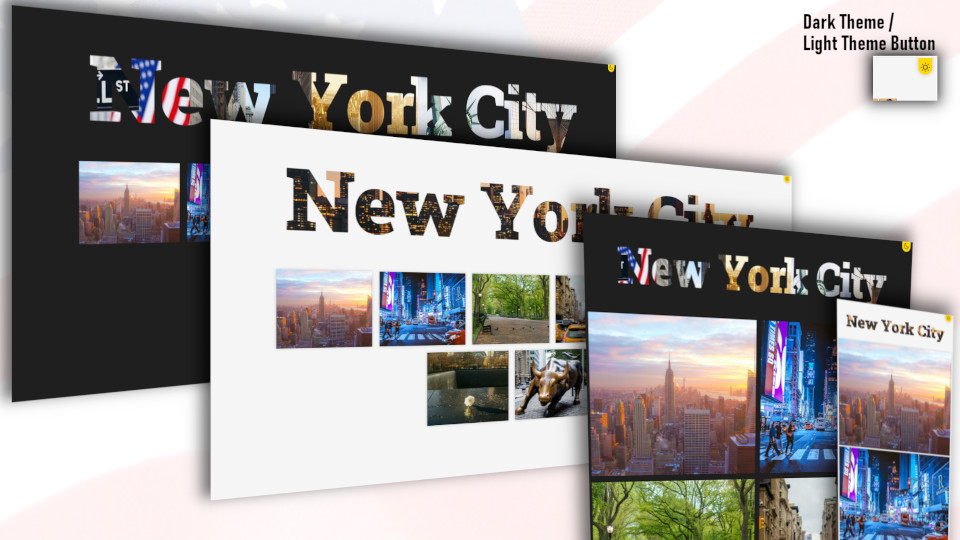

# EN - Engeto.cz - Homework - Lesson 5.1: Advanced Flexbox Properties

## Assignment
The homework assignment for **Lesson 5.1: Advanced Flexbox Properties** in the <a href="https://engeto.cz/webova-akademie/">Engeto Front-end Developer Academy</a> is to create a **photogallery**. The goal is to create a responsive photo gallery that will display nicely on **mobile**, **tablet**, and **desktop** devices. We will use **media queries** and **flexbox** to achieve this.

### Properties
- The gallery is created using a FLEXBOX grid
- Mobile-first approach
- CSS breakpoints: 576px, 768px, 992px
- <a href=“https://github.com/lokesh/lightbox2”>Lightbox2 JS Library</a>
- Dark/light theme switching
- Flash effect when hovering the mouse over the images

# Preview of my solution

# CZ - Engeto.cz - Domácí úkol - Lekce 5.1: Pokročilé vlastnosti flexboxu

## Zadání

Obsahem domácího úkolu lekce **Lekce 5.1: Pokročilé vlastnosti flexboxu** v <a href="https://engeto.cz/webova-akademie/">Engeto Front-end Developer Akademii</a> je je vytvoření **fotogalerie**. Cílem bude vytvoření responzivní fotogalerie, která se bude přívětivě zobrazovat na **mobilu**, **tabletu** i **desktopu**. Využijeme tedy **media queries** i **flexbox**.

### Vlastnosti
- galerie je vytvořna pomocí mřížky FLEXBOXU
- mobile-first přístup
- CSS breakpointy: 576px, 768px, 992px
- <a href="https://github.com/lokesh/lightbox2">Lightbox2 JS Library</a>
- dark/light theme přepínání
- flash efekt při najetí myši přes obrázky

### Náhled mého řešení

